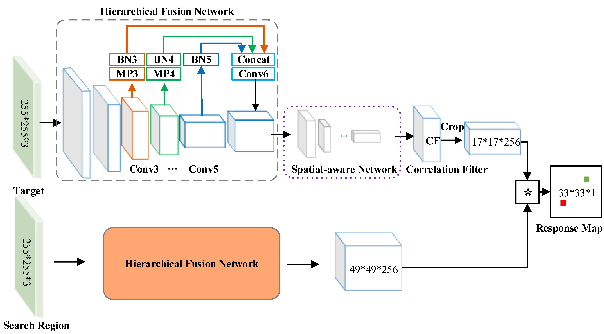
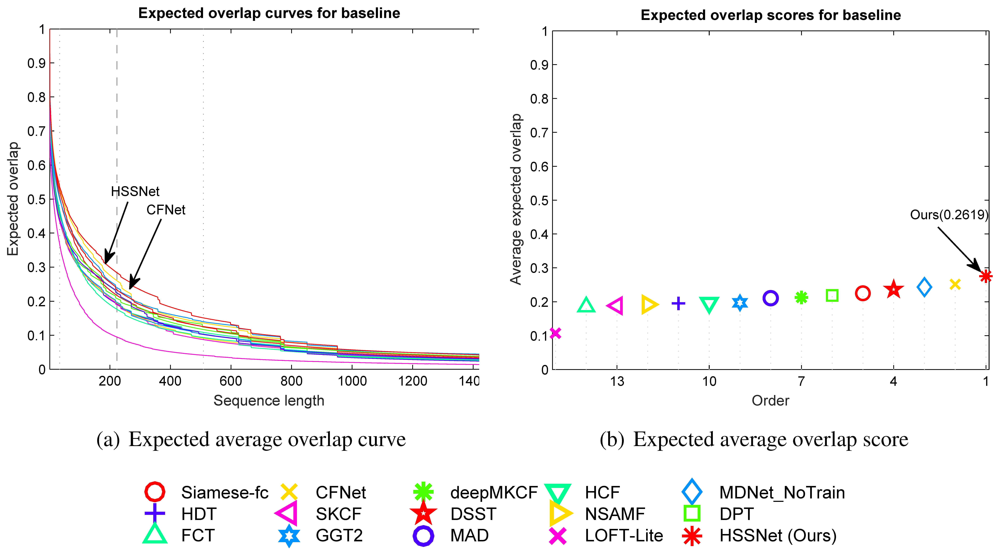

----------
Hierarchical Spatial-aware Siamese Network for Thermal Infrared Object Tracking (HSSNet)

## Abstract
We propose a thermal infrared (TIR) tracker via a Hierarchical Spatial-aware Siamese convolutional neural network (CNN), named **HSSNet**. To obtain both spatial and semantic features of the TIR object, we design a Siamese CNN coalescing the multiple hierarchical convolutional layers. Then, we propose a spatial-aware network to enhance the discriminative ability of the coalesced hierarchical feature. Subsequently, we train this network end to end on a large visible video detection dataset to learn the similarity between paired objects before we transfer the network into the TIR domain. Next, this pre-trained Siamese network is used to evaluate the similarity between the target template and target candidates. Finally, we locate the most similar one as the tracked target.
## Run Demos 
You can run the `runAll_vottir.m` to test several given videos in the `sequences` folder.

## Results on VOT-TIR2016

### Download the results
The results on the benchmark VOT-TIR2016 can be download in [here](https://drive.google.com/open?id=1G6zlFq2aGsnOazIluZjaB61eu8G5Q03N).
